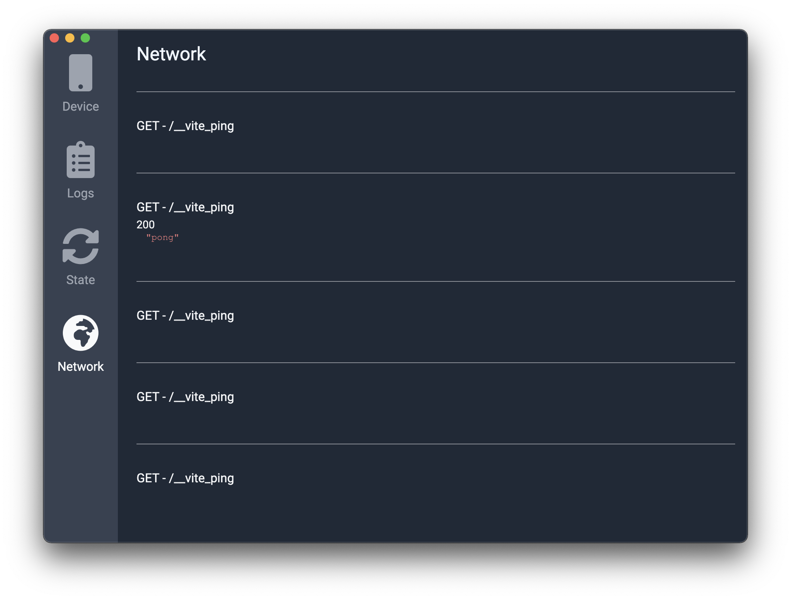

# Sveltotron

Sveltotron is an Electron-based app made to inspect your Svelte app.
It is heavily inspired by [Reactotron](https://github.com/infinitered/reactotron).



## Get started

**The repos have not been published yet. Use this repo as a dependency.**

1. Add the [`vite-plugin-sveltotron` dependency](/./packages/vite-plugin-sveltotron).

2. In `svelte.config.js`, add the following line:
   `import sveltotron from 'vite-plugin-sveltotron';`

3. Still in `svelte.config.js`, edit the `kit.vite.plugins` config property.
   This array should contain the previously imported `sveltotron()`.
   Refer to [`example/svelte.config.js`](/./example/svelte.config.js) for an example.

4. In `src/routes/__layout.svelte`, add the following lines of code:

```
import { startSveltotron } from '@sveltotron';
startSveltotron();
```

5. The `startSveltotron()` function can take a config object argument. It follows the following interface

```
interface {
    port: number | string; // DEFAULTS TO 9090
    host: string; // DEFAULTS TO '127.0.0.1'
    clientId: string; // DEFAULTS TO A RANDOM NUMBER
}
```

6. You are good to go. Open the Sveltotron app. You can either build it
   and open the generated executable file or run it from the command line
   with `yarn debugger`.

### Connect your Svelte stores

In order to connect your svelte stores, you must replace them with Sveltotron stores.

1. Add the [`@sveltotron/client` dependency](./packages/sveltotron-client).

2. Replace all imports from `svelte/store` to imports from `@sveltotron/client`;

3. Give a name to all your stores for them to be tracked. This is done by
   giving a string as the first argument to the store constructor. Examples can
   be found in [`example/src/lib/stores/index.ts`](./example/src/lib/stores/index.ts)
